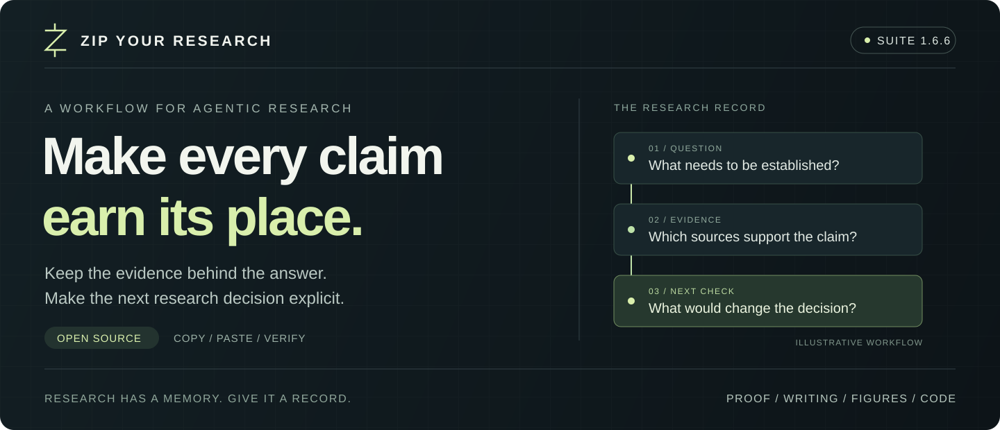

# ZIP-your-Research (ZYR) v1.6.6

<p align="center">
  <picture>
    <source media="(max-width: 600px)" srcset="docs/assets/zyr-cover-mobile-v1.6.6.svg">
    
  </picture>
</p>

<p align="center">
  <a href="#quick-start"><strong>Get started</strong></a> &nbsp;·&nbsp;
  <a href="docs/SHOWCASE.md"><strong>Explore verified cases</strong></a> &nbsp;·&nbsp;
  <a href="docs/SKILLS.md">Browse skills</a> &nbsp;·&nbsp;
  <a href="docs/USAGE.md">Documentation</a>
</p>

<p align="center">
  <a href="docs/VERSION_IDENTITY_v1.6.6.md"></a>
  <a href="LICENSE"></a>
  <a href="docs/SHOWCASE.md"></a>
</p>

**A research workflow you can inspect.** ZYR is a library of specialized
skills for AI research agents. Use it to evaluate ideas, design experiments,
check claims against evidence, and produce research artifacts. Its protocols
specify how to record decisions and choose the next verification step.

<p align="center"><em>让每一个研究判断，都有据可循。</em></p>

<table>
  <tr>
    <td align="center" width="33%"><h3>149</h3>Active skills<br><sub>Manifest-selected workflows</sub></td>
    <td align="center" width="33%"><h3>4</h3>Dedicated engines<br><sub>Proof · Writing · Figures · Code</sub></td>
    <td align="center" width="33%"><h3>33 / 33</h3>Routing cases passed<br><sub>Local verification · 2026-09-04</sub></td>
  </tr>
</table>

## Put ZYR to work

| Your next research decision | Start here | Work product |
|---|---|---|
| **Is this idea worth testing?** | [Research orchestration](skills/research_orchestrator/S660_epistemic_research_champion.md) + [proof engine](skills/proof_engine/MASTER_v1.5.md) | A question graph, competing candidates, and the next decisive check |
| **Does the evidence support this claim?** | [Claim–evidence audit](skills/research_core/S203_claim_evidence_matrix.md) + [logic audit](skills/research_core/S226_logic_consistency_audit.md) | Claims mapped to sources, assumptions, and unresolved gaps |
| **How should we communicate the result?** | [Writing engine](skills/writing_engine/MASTER_v1.6.6.md) + [figure engine](skills/figure_engine/MASTER_v1.6.5.md) | Prose and source-editable visuals tied to the research record |
| **Can this procedure be reused?** | [Dynamic Skill memory](skills/research_orchestrator/S661_dynamic_skill_memory.md) | A versioned Skill proposal with evaluation and explicit activation controls |

ZYR runs inside your agent host. Retrieval, worker agents, and rendering use
the tools available there; the workflows declare the capabilities they need.

## Evidence you can rerun

**33 routing cases passed. 52 Python tests passed, with 1 platform-specific
skip.** The snapshot below was executed locally on **2026-09-04** with
**Python 3.13.2 / Windows**.

| Test case | Observed result |
|---|---|
| “不要证明，只润色摘要” — polish only | Selects `writing_engine`; excludes `proof_engine` |
| A reference document tries to override the route | Selects citation audit `S424`; records the untrusted payload as ignored |
| “不要画图，但最后请画一个流程图。” — conflicting instructions | Returns `ROUTE_AMBIGUOUS` with no execution plan |
| Memory write with wrong consent or a forged attestation | Rejects the operation; the temporary store remains absent |
| Synthetic credentials in provider responses | Redacts credentials in returned metadata and errors; 3/3 tests pass |

[**Read the inputs, outputs, and reproduction commands →**](docs/SHOWCASE.md)

These results cover repository checks and implemented tool behavior. The
**12 mutation/clean fixture pairs** also pass structural validation; S660
model evaluation and scientific-outcome evaluation remain **NOT_RUN**.
The [snapshot record](docs/evidence/2026-09-04/results.json) identifies the
tested pre-publication tree, including the v1.6.6 alignment changes, and the
single Windows skip.

<details>
<summary><strong>Why ZYR: operating model, release identity, and capabilities</strong></summary>

> **Build research decisions on evidence you can inspect.**

**ZIP-your-Research (ZYR)** is an open, repository-first operating layer for
agentic research. Copy/paste-ready Skills and deterministic routing connect a
task to specialized proof, writing, figure, and coding workflows. Host-mediated
retrieval and multi-agent protocols feed a visible research record.

The workflows specify **what must be checked next**, why a claim changed, and
which contradictions remain unresolved. Verified procedures can be proposed
for later reuse through explicit memory controls.

## Version identity

- **Suite release:** `v1.6.6`. This is the only version that should be shown as
  the current ZIP-your-Research release in user-facing responses and artifacts.
- **Compatibility lineage:** filenames containing `v1.3.2`, `v1.3`, `v1.5`, or
  `v1.6.5` identify preserved component contracts or historical artifacts; they
  do not downgrade the installed suite release.
- **Active entrypoints:** use `boot/00_RESPONSE_STATUS_BANNER_v1.6.6.md`,
  `boot/01_GLOBAL_GUARDRAILS_v1.6.6.md`, and the manifest-selected engine paths.

The normative precedence rule is documented in
[`docs/VERSION_IDENTITY_v1.6.6.md`](docs/VERSION_IDENTITY_v1.6.6.md).

## Why ZYR

| Research pressure | What ZYR adds |
|---|---|
| A broad prompt produces a confident but untraceable answer | Task lock, decision lock, deterministic routing, and explicit completion states |
| Literature search becomes a list of agreeable citations | Authoritative retrieval, source inspection, evidence lineage, contradiction retention, and `UNKNOWN` when verification is absent |
| Several agents repeat the same opinion | Capability-gated worker contexts, blind first rounds, functionally distinct critics, and scientific adjudication |
| A promising idea improves only rhetorically | Candidate versioning, assumptions, falsifiers, proof obligations, decisive experiments, and `NO_SCIENTIFIC_DELTA` |
| Paper language sounds polished while the logic remains weak | Proof-first claim audits followed by dedicated writing, rhetoric, citation, and global logic gates |
| Figures are attractive but scientifically ambiguous | Source-code-first figure design, caption/claim consistency checks, data lineage, and capability-aware rendering |
| Useful procedures disappear after the task | Visible short-/long-term memory proposals and approval-gated dynamic Skill creation, evaluation, update, rollback, deprecation, and deletion |

## What v1.6.6 brings together

- **S660 Epistemic Research Champion**: a protocol for multi-round research
  using host-provided worker contexts and inspected authoritative sources.
- **S661 Dynamic Skill Memory**: successful procedures can become externally
  stored `dyn-*` Skills only after content-bound planning, signed host consent,
  holdout comparison, and explicit lifecycle decisions.
- **Scientific Decision Record (SDR)**: claims, evidence, candidate changes,
  objections, negative results, proof status, experiment status, and stop
  reasons remain visible and reviewable.
- **Four dedicated engines**: specialized workflows for proof, writing,
  figures, and coding, selected through deterministic routing.
- **Fail-closed validation and release**: structural checks, behavioral checks,
  and scientific evidence are reported separately; missing evidence is never
  promoted by wording.

## The operating contract

ZYR supplies workflow instructions and verification tools; the host supplies
execution capabilities. Scientific conclusions depend on the sources,
proofs, experiments, and checks recorded for the task.

The default operating rule is:

```text
lock the task
→ verify host capabilities
→ route to the applicable engine and skills
→ preserve evidence and rejected paths
→ verify the resulting artifact
→ report PASS, FAIL, PARTIAL, BLOCKED, or UNKNOWN without upgrading the evidence
```

</details>

## Quick start

For a local checkout, verify the public entrypoint first:

```bash
git clone https://github.com/ARC0127/ZIP-your-Research.git
cd ZIP-your-Research
python3 -m pip install -r requirements.txt
python3 tools/zyr.py manifest
python3 tools/zyr.py route "authoritative multi-agent research with evidence lineage"
```

Then:

1. Open the checkout as the project/workspace in a local Agentic app, or attach
   the release ZIP to a web host that can read repository files.
2. Describe the research decision, available evidence, constraints, and desired
   artifact.
3. Complete intake and `MODE_LOCK`; provide `CONFIRM` when the selected boot
   protocol requires it.
4. Name the relevant engine or let the deterministic router select it.
5. Require the result to separate performed checks, failed checks, and
   uninspected or unresolved items.

Copy/paste starter:

```text
Call ZYR v1.6.6 under MODE_LOCK.
Objective: determine whether [candidate method] warrants a controlled pilot.
Decision: select the next decisive proof, experiment, or retrieval action.
Inputs: [files, URLs, data, code, figures, constraints].
Required route: S660 with proof_engine and experiment skills as applicable.
Hard boundaries: authoritative web retrieval, no fabricated agent transcripts,
no silent scope change, no persistent memory write.
Output: completed templates/orchestration/RESEARCH_RUN.md with evidence lineage,
candidate versions, objections, stop reason, and UNKNOWN verification actions.
```

<details>
<summary><strong>Research orchestration, the scientific record, and governed memory</strong></summary>

## What research self-evolution means here

`S660 epistemic_research_champion` defines **task-level epistemic and operational
evolution**. A locked research task can improve its:

- question graph and search frontier;
- inspected evidence and contradiction map;
- candidate mechanism, assumptions, predictions, and falsifiers;
- proof obligations and experiment design;
- next highest-information action.

Each material change is recorded from `candidate_v0` to `candidate_vN` with a
round delta. A round that changes only wording or appearance is
`NO_SCIENTIFIC_DELTA`.

This protocol does **not** authorize the assistant to modify its model weights,
system policy, source code, validators, evaluation rules, or persistent memory.
Those are separate engineering or governance actions and require their own
locked task and approval. Agent agreement is not a truth criterion, and agents
using the same base model are not independent scientific replications.

The S660 flow is:

```text
task and decision lock
→ host capability handshake
→ question graph
→ blind first-round authoritative retrieval
→ evidence lineage and contradiction retention
→ materially distinct candidate_v0 alternatives
→ functional cross-examination
→ immutable candidate_vN and ROUND_DELTA
→ scientific adjudication or NO_CHAMPION_READY
→ read-only rendering
→ visible, non-persistent memory proposal
```

S660 requires real host-provided worker contexts, blind first-round isolation,
web/page inspection, recoverable citations, and an approval channel for
persistent writes. When required capabilities are absent, the correct status is
`MULTI_AGENT_UNAVAILABLE`; ZYR must not invent a multi-agent transcript.

Use:

- `skills/research_orchestrator/S660_epistemic_research_champion.md`
- `templates/orchestration/RESEARCH_RUN.md`
- `interfaces/host_adapter_contract.md`
- `docs/memory/VISIBLE_MEMORY_PROTOCOL_v1.md`

## Scientific Decision Record and read-only rendering

The claim ledger, evidence lineage, candidate versions, proof/experiment
status, and adjudication sections of `RESEARCH_RUN.md` together form the
**Scientific Decision Record (SDR)** for a run.

The rendering contract treats writing, bilingual polishing, citation
formatting, tables, figures, and diagrams as read-only uses of that record.
They must preserve claim IDs,
epistemic modality, negation, equations, values, denominators, units,
uncertainty, citations, limitations, negative results, and generalization
boundaries. If rendering needs a new scientific claim or changes one of these
objects, execution returns to the earliest affected research state.

A fluent paragraph or attractive figure cannot change `UNKNOWN` to
`SUPPORTED`, `SUPPORTED` to `PROVED`, or an association into a causal result.

## Visible memory boundary

Markdown records are the human-reviewable memory authority. Embeddings, search
indexes, graphs, and caches may be derived for retrieval, but they are
rebuildable aids rather than truth sources.

Memory is **non-persistent by default**:

- short-term memory expires with the run unless the user chooses otherwise;
- long-term records remain `PROPOSED_ONLY` until their exact contents, scope,
  destination, and retention are approved;
- a web host may offer a user-triggered Markdown download, but must not save or
  upload memory in the background;
- a Codex/local host must first show the exact records and absolute target, then
  obtain a second, write-specific confirmation before saving them;
- approval to run S660 is not approval to write memory, edit source code, stage
  Git changes, commit, push, or upload;
- secrets, credentials, raw source instructions, and cross-project content
  without explicit scope are not valid long-term memory.

The visible templates are under `templates/memory/`.

## Dynamic Skill memory

`S661 dynamic_skill_memory` turns a verified run trace into a reusable
procedural-Skill candidate and governs its full lifecycle:

```text
VERIFIED_SUCCESS trace
-> read-only content-bound proposal
-> user-approved PILOT
-> NO_SKILL / CHAMPION / CHALLENGER evaluation
-> user-approved ACTIVE
-> immutable update, rollback, or deprecation
-> separately planned and approved deletion
-> content-free DELETED tombstone
```

Automatic candidate generation is not automatic save, registration,
activation, update, or deletion. Dynamic Skills live only in an explicit
external root, use the `dyn-*` namespace, and cannot modify or delete built-in
ZYR Skills, manifests, validators, or policy.

P0 generated Skills are declarative Markdown only. Executable code fences,
runtime installers, preauthorized tools, secrets, prompt overrides,
path traversal, symlinks, junctions, and hardlinks fail closed. Every mutation
uses a read-only plan followed by a second apply phase bound to the exact root,
operation, paths, hashes, version, source records, and a short-lived Ed25519
attestation from a pinned trusted-host key. A bare consent ID is not user
authorization. Each applied lifecycle event retains a detached signed
authorization receipt; verification rechecks the receipt chain and binds the
latest signed plan to the complete registry hash. Detecting restoration of a
complete earlier valid snapshot requires an external monotonic anchor.

Start with:

```bash
python3 tools/zyr.py skill-memory draft /absolute/path/TRACE.yaml
python3 tools/zyr.py skill-memory plan create \
  --root /absolute/external/dynamic-root \
  --proposal /absolute/path/PROPOSAL.yaml \
  --trusted-consent-public-key /host/HOST_PUBLIC_KEY.pem
```

Do not run `apply` until the trusted host has displayed the complete preview
and the user has returned the exact `APPROVE zyr-smc-...` confirmation. The
host must sign that exact plan with a private key unavailable to the agent.
Interrupted transactions fail closed and use a separately approved
`plan recover` / `apply recover`; delete payloads are first moved to reversible
same-volume quarantine. See
`docs/memory/DYNAMIC_SKILL_MEMORY_PROTOCOL_v1.md` and
`templates/skill_memory/`.

</details>

<details>
<summary><strong>Engine bindings, routing guide, and architecture</strong></summary>

## Mandatory engine bindings

A dedicated engine takes precedence over generic chat behavior when its task
class applies.

### Research idea, method, contribution, theorem, or storyline

Use `proof_engine` before prose polishing:

```text
research logic task
→ proof_engine
→ S203 claim_evidence_matrix
→ S226 logic_consistency_audit
→ S227 method_correctness_audit
→ S230 proof_idea_check
→ S237 theorem_assumption_normalizer when assumptions matter
→ S240 / S241 for pessimistic or progressive verification
→ writing_engine only after the SDR is stable
```

For autonomous multi-agent retrieval and candidate evolution, place S660 before
the applicable proof and experiment skills.

### Writing, rewriting, translation, and document prose

Use `writing_engine`, backed by the preserved
Research-Paper-Writing-Skills source tree:

```text
writing task
→ writing_engine
→ ext/src/rpws/
→ S601 / S602 / S603 / S604 as applicable
→ S640 global logic and language gate
```

If the scientific decision is unstable, return to S660 or `proof_engine`
instead of repairing it through prose.

### Figures, plots, diagrams, and visual claims

In a full local checkout, use `figure_engine` with the preserved figures4papers
source tree:

```text
figure task
→ figure_engine
→ inspect ext/src/figures/ first
→ S621 / S622 / S623 as applicable
→ coding_engine only for execution or code repair
```

Keep source-code-first generation and structured data-loading logic. SVG, PNG,
and PDF are exports, not substitutes for the generating source. In a full local
checkout, inspect a close figures4papers pattern before creating a new design.
The safety release excludes `ext/src/figures/` while its local license evidence
is `UNKNOWN`. `manifests/RELEASE_CAPABILITIES.yaml` is the machine-readable
authority for that boundary: a source-dependent figure route must return
`SOURCE_UNAVAILABLE` rather than claim inspection or rendering. `S623` may
still perform a read-only claim/caption audit on a visual supplied by the user.

### Code, repository, validation, and release

Use `coding_engine` for bounded code or repository changes:

```text
code or repository task
→ coding_engine
→ smallest sufficient patch
→ closed-loop verification
→ S650 for package or release validation
```

`S650` covers integrated package validation, source preservation, manifests,
checksums, and no-omission review. A build or schema pass is structural
evidence; it is not behavioral or scientific validation.

## Routing guide

| Task | Primary route | Required companions |
|---|---|---|
| Multi-agent authoritative research and candidate evolution | `S660` | host capability contract, `RESEARCH_RUN.md`, applicable proof/experiment skills |
| Generate, evaluate, update, rollback, or delete procedural Skill memory | `S661` | `S660`, `S303`, `S414`, `S423`, `S431`; exact plan/apply consent |
| Research idea, method, contribution, or storyline | `proof_engine` | `S203`, `S226`, `S227`, `S230`; add `S237/S240/S241` when needed |
| Manuscript logic audit or reviewer simulation | `proof_engine` + `writing_engine` | `S602` + `S640` |
| Paper section, proposal, README, or recommendation letter | `writing_engine` | `ext/src/rpws/`, `S601`, `S640`; use the SDR as read-only input |
| Rewrite, polish, compress, expand, or translate | `writing_engine` | `S603` + `S640` |
| Result paragraph, table, or figure caption | `writing_engine` | `S604` + `S640`; add `S623` for visual-evidence consistency |
| Scientific figure, workflow, or architecture diagram | `figure_engine` | inspect `ext/src/figures/`; use `S621` + `S623` |
| Plotting code, export, or repair | `figure_engine` + `coding_engine` | `S622`, `S621`, `S623`; retain source and data lineage |
| Experiment, metric, ablation, or leakage review | `proof_engine` + experiment skills | `S301`-`S328`, especially `S301`, `S303`, `S305`, `S307`, `S327`, `S328` |
| Code repair or repository change | `coding_engine` | `S402`, `S407`, `S421`, `S431`, `S432` |
| ZIP, manifest, checksum, path, or no-omission check | `S650` | repository validators and release tools |

## Architecture

| Layer | Purpose | Main paths |
|---|---|---|
| Control | Bootstrap, intake, mode lock, guardrails, deterministic routing | `boot/`, `router/` |
| Epistemic orchestration | Capability-gated multi-agent retrieval, candidate evolution, adjudication | `skills/research_orchestrator/`, `templates/orchestration/`, `interfaces/` |
| Engines | Proof, writing, figure, and coding workflows | `skills/proof_engine/`, `skills/writing_engine/`, `skills/figure_engine/`, `skills/coding_engine/` |
| Atomic skills | Research, experiment, paper, reproducibility, and integrated operations | `skills/research_core/`, `skills/exp/`, `skills/paper_ops/`, `skills/reproducibility/`, `skills/rwf_s340/` |
| Visible and Skill memory | Human-reviewable memory plus governed dynamic procedural Skills | `docs/memory/`, `templates/memory/`, `templates/skill_memory/`, `tools/zyr_lib/skill_memory.py` |
| Local source references | Attributed upstream and user-authored material; release inclusion is governed separately by license evidence | `ext/src/` |
| Validation and evaluation | Manifests, validators, public paired mutation fixtures, artifact checks | `skills_manifest.yaml`, `manifests/`, `tools/`, `tests/evolution/`, `artifacts/` |

Keep three statuses separate:

| Status | What it can establish |
|---|---|
| Structural | Required files, schemas, references, builds, or validators have the reported result. |
| Behavioral | The system took the expected action on named, executed cases. |
| Scientific | A bounded claim has the stated evidence, proof, experiment, or replication status. |

The public fixtures in `tests/evolution/public_mutations_v1.jsonl` encode 12
mutation/clean-twin pairs for later behavioral evaluation. The current
deterministic test verifies their schema, pairing, coverage, and required
protocol markers; it does not execute an LLM or establish that S660 detects the
mutations. That behavioral result remains `NOT_RUN`.

</details>

<details>
<summary><strong>Installation, release validation, and repository map</strong></summary>

## Installation and validation

Install dependencies:

```bash
python3 -m pip install -r requirements.txt
```

Use the stable repository facade for normal operation. `init` is a dry run
unless `--apply` is supplied:

```bash
python3 tools/zyr.py manifest
python3 tools/zyr.py init /absolute/path/to/research-workspace
python3 tools/zyr.py build --check
python3 tools/zyr.py check --ci
python3 tools/zyr.py route-test
python3 tools/zyr.py skill-memory --help
```

Invoke a trusted route through the same facade:

```bash
python3 tools/zyr.py route "autonomous multi-agent research evidence lineage S660"
```

`tools/build_all.py`, `tools/validate_v7_2.py`, `tools/validate_v1_3.py`, and
the older direct router/build entrypoints remain compatibility-only. They are
not the standard interface. See `manifests/COMPATIBILITY.yaml` for the
authoritative replacement mapping.

### Safe release and release audit

The v1.7 packaging protocol is fail-closed and does not replace the repository
release version, which is v1.6.6. Build only from a clean Git worktree:

```bash
python3 tools/make_release.py --out /absolute/path/ZIP-your-Research_v1.6.6_release.zip
python3 tools/zyr.py release-audit /absolute/path/ZIP-your-Research_v1.6.6_release.zip
```

The builder selects Git-tracked files through
`manifests/release_policy.yaml`, creates a deterministic content manifest, and
refuses dirty trees, unsafe ZIP paths, symlinks, configured secret patterns,
and third-party assets that fail the local license and redistribution gate.
`release-audit` inspects an existing ZIP without extraction and checks archive
integrity, deterministic metadata, the policy-required exact set, all active
skill paths, self-check inputs, capability declarations, third-party evidence,
and secret patterns. CI then extracts the already-audited archive and runs
`zyr.py check --ci` plus `route-test` from inside the package.

Under the current fail-closed policy:

- `ext/src/rpws/` may be released because a local MIT license is present and
  redistribution is marked `ALLOWED`;
- `ext/src/figures/` and `ext/src/awesome/` are excluded because their
  checked-in license evidence is `UNKNOWN` and redistribution is `BLOCKED`;
- local presence, attribution, or internal use is not evidence of permission to
  redistribute.

Legacy cleanup changes repository contents. Inspect it with `--dry-run` and use
it only in an appropriate clean or disposable worktree; it is not a
prerequisite to read or invoke the skills.

## Repository map

```text
boot/                         bootstrap, migration, intake, mode lock, guardrails
router/                       deterministic routing and route addenda
skills/research_orchestrator/ task-level epistemic evolution and adjudication
skills/proof_engine/          idea, theorem, derivation, claim, and logic checks
skills/writing_engine/        RPWS-backed prose and read-only SDR rendering
skills/figure_engine/         capability-gated visual rendering and auditing
skills/coding_engine/         debugging, patching, and code verification
skills/research_core/         research framing, novelty, literature, method checks
skills/exp/                   experiment design, metrics, ablations, sanity checks
skills/paper_ops/             paper operations, rebuttal, captions, release notes
skills/reproducibility/       artifacts, dependencies, security, verification
skills/rwf_s340/              integrated S601-S604, S621-S623, S640, S650
templates/orchestration/      visible RESEARCH_RUN artifact
docs/memory/                  visible memory protocol
templates/memory/             proposal, consent, audit, export, and memory records
templates/skill_memory/       trace, proposal, evaluation, consent, deletion records
interfaces/                   host capability and provider contracts
tests/evolution/              paired public epistemic mutation fixtures
ext/src/                      preserved upstream and user-authored sources
manifests/                    inventories, checksums, compatibility, release audits
tools/                        validators, builders, migration and packaging tools
artifacts/                    durable task, evidence, proof, and release artifacts
docs/how_to_use/              operational guides
```

The complete acknowledgments, upstream references, preservation notes, and
license-boundary statements below are an intentional part of this release and
must be retained.

</details>

## Acknowledgments and references

ZYR is open work. Its design was shaped by public research systems,
proof-verification papers, open learning materials, and open-source
writing/figure-making repositories. These works informed the system; they are
not claimed here as original ZYR inventions.

Architecture and control-plane references include [Google AI
co-scientist](https://research.google/blog/accelerating-scientific-breakthroughs-with-an-ai-co-scientist/),
[OpenAI deep
research](https://openai.com/index/introducing-deep-research/), [A Vision for
Auto Research with LLM Agents](https://arxiv.org/abs/2504.18765),
[PiFlow](https://arxiv.org/abs/2505.15047),
[AI-Researcher](https://arxiv.org/abs/2505.18705),
[ResearStudio](https://arxiv.org/abs/2510.12194),
[FS-Researcher](https://arxiv.org/abs/2602.01566),
[OR-Agent](https://arxiv.org/abs/2602.13769),
[EvoScientist](https://arxiv.org/abs/2603.08127),
[ResearchPilot](https://arxiv.org/abs/2603.14629),
[AI-Supervisor](https://arxiv.org/abs/2603.24402), and the public-description
source for [FARS](https://www.thepaper.cn/newsDetail_forward_32600597).

The S660 orchestration and evaluation boundary also draws on the following
primary or first-party sources:

- production and scientific-agent architectures: [Anthropic's multi-agent
  research system](https://www.anthropic.com/engineering/multi-agent-research-system),
  the peer-reviewed [Co-Scientist
  study](https://www.nature.com/articles/s41586-026-10644-y), and the [OpenAI
  deep research system
  card](https://openai.com/index/deep-research-system-card/);
- task-level feedback without an implied weight update:
  [Reflexion](https://proceedings.neurips.cc/paper_files/paper/2023/hash/1b44b878bb782e6954cd888628510e90-Abstract-Conference.html)
  and
  [Self-Refine](https://proceedings.neurips.cc/paper_files/paper/2023/hash/91edff07232fb1b55a505a9e9f6c0ff3-Abstract-Conference.html);
- multi-agent reasoning and its unresolved independence/consensus limits:
  [Multiagent Debate](https://arxiv.org/abs/2305.14325) and the controlled
  study [Can LLM Agents Really
  Debate?](https://arxiv.org/abs/2511.07784);
- research and citation evaluation:
  [BLADE](https://aclanthology.org/2024.findings-emnlp.815/),
  [ResearchArena](https://aclanthology.org/2025.findings-emnlp.303/),
  [ALCE](https://aclanthology.org/2023.emnlp-main.398/), and
  [CheckList](https://aclanthology.org/2020.acl-main.442/);
- governance, untrusted-content, and memory boundaries: [NIST AI
  600-1](https://www.nist.gov/publications/artificial-intelligence-risk-management-framework-generative-artificial-intelligence),
  [OWASP AI Agent Security](https://cheatsheetseries.owasp.org/cheatsheets/AI_Agent_Security_Cheat_Sheet.html),
  [MemBench](https://aclanthology.org/2025.findings-acl.989/), and the
  preprint [From Untrusted Input to Trusted
  Memory](https://arxiv.org/abs/2606.04329).

These sources motivate design and evaluation questions. Their results do not
establish that S660 improves a scientific outcome; that remains
`UNKNOWN_PENDING_BEHAVIORAL_EVAL` until a controlled evaluation is run.

The visible-memory retrieval design also considered
[Transformer-XL](https://arxiv.org/abs/1901.02860),
[RETRO](https://arxiv.org/abs/2112.04426),
[Memorizing Transformers](https://arxiv.org/abs/2203.08913), and
[HippoRAG](https://arxiv.org/abs/2405.14831). P0 deliberately does not train or
embed a new memory model. Canonical memory remains inspectable Markdown; a
Transformer embedding retriever, approximate-nearest-neighbor index,
cross-encoder reranker, or graph retriever is an optional, versioned,
rebuildable cache whose similarity score cannot change consent or epistemic
status.

The dynamic Skill-memory design additionally inspected
[DojoAgents](https://pypi.org/project/dojoagents/),
[MemSkill](https://arxiv.org/abs/2602.02474),
[Memento-Skills](https://github.com/Memento-Teams/Memento-Skills),
[Acontext](https://github.com/memodb-io/Acontext), the
[Agent Skills specification](https://agentskills.io/specification), and the
[OpenAI Agents SDK memory
guide](https://openai.github.io/openai-agents-js/guides/sandbox-agents/memory/).
These sources motivate Skill-as-memory, hard-case evolution, progressive
disclosure, and extraction/consolidation separation. They do not establish
that an automatically generated ZYR Skill improves research quality.

Comparative open-source systems inspected during the design include
[PaperQA2](https://github.com/Future-House/paper-qa) for scientific-document
retrieval with citations, [STORM/Co-STORM](https://github.com/stanford-oval/storm)
for multi-perspective knowledge curation, and
[The AI Scientist](https://github.com/SakanaAI/AI-Scientist) for an
experiment-to-paper workflow and its explicit arbitrary-code execution risk.
They are references, not bundled dependencies, and their reported results do
not transfer to ZYR.

For figure and diagram work, the comparison set includes the official
[draw.io](https://github.com/jgraph/drawio) editor and
[SciencePlots](https://github.com/garrettj403/SciencePlots), in addition to the
locally preserved figures4papers source. P0 adopts their source-editable and
publication-style lessons while keeping the SDR, data lineage, uncertainty,
and visual-claim audit authoritative; visual polish is not scientific
verification.

Proof and theory references include [Pessimistic Verification for Open-Ended
Math Questions](https://arxiv.org/abs/2511.21522),
[Hard2Verify](https://arxiv.org/abs/2510.13744), [Scaling Flaws of
Verifier-Guided Search in Mathematical
Reasoning](https://arxiv.org/abs/2502.00271), [Improving Value-based Process
Verifier via Low-Cost Variance
Reduction](https://arxiv.org/abs/2508.10539), [Asking LLMs to Verify First is
Almost Free Lunch](https://arxiv.org/abs/2511.21734), [AI
Mathematician](https://arxiv.org/abs/2505.22451),
[StepProof](https://arxiv.org/abs/2506.10558),
[Goedel-Prover](https://arxiv.org/abs/2502.07640),
[Goedel-Prover-V2](https://arxiv.org/abs/2508.03613),
[Leanabell-Prover-V2](https://arxiv.org/abs/2507.08649), and
[APOLLO](https://arxiv.org/abs/2505.05758).

Open learning and community references include [Hello-Agents
(Datawhale)](https://github.com/datawhalechina/hello-agent).

The full local working tree contains the following external sources for
attributed workflow use. Local presence and attribution do not by themselves
grant redistribution rights. The v1.7 fail-closed safety release includes only
assets that pass `manifests/THIRD_PARTY_ASSETS.yaml` and
`manifests/release_policy.yaml`.

- [Research-Paper-Writing-Skills](https://github.com/Master-cai/Research-Paper-Writing-Skills),
  present under `ext/src/rpws/`, for paper structure, section guides, and
  claim-evidence writing discipline. Its local MIT license is verified, so it
  is admitted by the current safety release policy.
- [Prof. Peng Sida's open research
  notes](https://github.com/pengsida/learning_research), acknowledged through
  the upstream attribution of Research-Paper-Writing-Skills.
- [awesome-ai-research-writing](https://github.com/Leey21/awesome-ai-research-writing),
  present under `ext/src/awesome/`, for academic-writing prompts, bilingual
  rewriting patterns, and logic-checking examples. Its checked-in license
  evidence is currently `UNKNOWN`, so the safety release excludes it.
- [figures4papers](https://github.com/ChenLiu-1996/figures4papers), present
  under `ext/src/figures/`, for scientific figure-design principles, plotting
  scripts, demonstrations, and reusable figure-generation patterns. Its
  checked-in license evidence is currently `UNKNOWN`, so the safety release
  excludes it.

For detailed attribution and integration boundaries, see:

- `docs/ATTRIBUTION.md`
- `docs/EXTERNAL_SKILL_ATTRIBUTION_v1.6.md`
- `docs/integrated_external_skills/README_integrated_stack_v1.0.md`
- `research/auto_research_inventory.md`
- `research/engineering_alignment_matrix.md`
- `research/fars_deep_dive.md`
- `research/pessimistic_verification_lineage.md`
