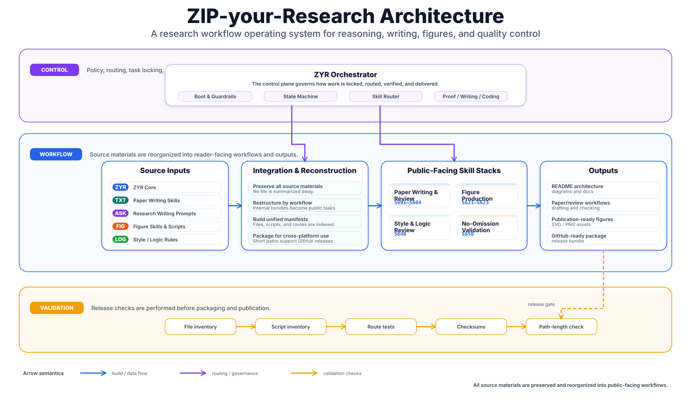

# ZIP-your-Research (ZYR) v1.6.3

**ZIP-your-Research (ZYR)** is a repository-first research workflow system for GPT/Codex-style assistants. It is designed for research tasks where the assistant must preserve task boundaries, evidence, file state, and final artifacts across long conversations and repeated revisions.

ZYR is not an autonomous job runner. It is a control-and-verification layer: it tells an assistant how to lock a task, select the correct engine, preserve evidence, execute the work, and report what has or has not been verified.

## What ZYR is for

Use ZYR when the work is too important to be handled as ordinary chat. Typical use cases include:

- manuscript, proposal, recommendation-letter, and README revision;
- claim-evidence review, proof-style audit, and reviewer-response preparation;
- code repair, repository cleanup, release packaging, and CI validation;
- experiment planning, result interpretation, metric sanity checks, and reproducibility review;
- publication-quality figure planning, caption audit, and plotting-code repair;
- loss-minimizing migration prompts and append-only project handoff.

The core rule is:

```text
Lock the task before executing it.
Route the task to the right engine.
Verify the artifact before accepting the result.
```

## Execution flow

A standard ZYR session follows the same state-machine logic as the earlier ZYR line:

```text
repository or ZIP loaded
→ bootstrap protocol
→ migration detection if needed
→ intake and task-boundary lock
→ MODE_LOCK
→ explicit CONFIRM when required
→ locked execution
→ router selects engine / skill stack
→ proof, writing, coding, experiment, figure, or release workflow
→ artifact output and validation report
```



The v1.6 line is additive: it keeps the boot, mode-lock, proof, completion, and migration discipline from v1.5, and adds explicit research-writing, figure-making, S340 writing-quality review, and no-omission release-validation workflows.

## Architecture

| Plane | Purpose | Main paths |
|---|---|---|
| Control plane | Bootstrap, migration detection, intake, mode lock, locked execution, and global guardrails | `boot/`, `router/` |
| Engine plane | Composite execution engines for broad task families | `skills/proof_engine/`, `skills/writing_engine/`, `skills/coding_engine/` |
| Skill plane | Research, experiment, paper-operation, reproducibility, and integrated writing/figure/S340 skills | `skills/research_core/`, `skills/exp/`, `skills/paper_ops/`, `skills/reproducibility/`, `skills/rwf_s340/` |
| Source-preservation plane | Upstream and user-authored source materials retained for attribution and reference | `ext/src/` |
| Validation plane | Manifests, checksums, path reports, validators, and release checks | `manifests/`, `tools/`, `artifacts/` |

## If I need X, which engine should I control?

A useful ZYR instruction should specify the task type, the engine or skill stack, the input material, the required artifact, and the final validation. Use the table below as the default routing guide.

| If the task is... | Control ZYR to call... | Typical skills / files | Expected result |
|---|---|---|---|
| Start a new task or resume a migrated project | Bootstrap + router | `boot/00_BOOTSTRAP_PROTOCOL_v1.3.2.md`, `boot/04_MODE_LOCK_FORMAT_v1.3.2.md` | Locked task boundary, deliverable type, acceptance criteria, and execution mode |
| Verify a research idea, theorem, derivation, or method claim | `proof_engine` | `skills/proof_engine/MASTER_v1.5.md`, often `S203`, `S226`, `S227`, `S240`, `S241` | Fact / assumption / inference separation, contradiction check, unsupported-claim report |
| Review a manuscript for logic, contribution, and claim-evidence alignment | `proof_engine` + writing review route | `S602` + mandatory `S640` | Reviewer-style issues, section-level causal gaps, evidence mismatch, and concrete fixes |
| Write or restructure a paper section, proposal, research plan, or README | `writing_engine` + S340 review | `S601` + mandatory `S640`; add `S602` for claim-evidence review | Problem-gap-method-evidence structure before sentence-level polish |
| Revise prose, compress wording, expand reasoning, translate, or reduce AI-like tone | `writing_engine` | `S603` + mandatory `S640` | Delta-aware revision that preserves locked meaning, citations, numbers, formulas, and style constraints |
| Revise a Word document with tracked/redline-style constraints | `writing_engine` + document workflow | `S603` + `S640`; add proof check after revision | Template-preserving Word revision, red-marked additions/changes, and revision report |
| Write result paragraphs, table captions, figure captions, or ablation narratives | `writing_engine` + result-narrative route | `S604` + `S640`; add `S623` when a visual claim is involved | Evidence-bounded result narrative with correct metric direction and caption scope |
| Plan experiments, choose metrics, design ablations, or check experimental completeness | `proof_engine` + experiment skills | `S301`-`S328`, especially `S301`, `S303`, `S305`, `S307`, `S327`, `S328` | Minimal decidable experiment design and claim-evidence alignment |
| Analyze experiment results and decide whether a paper claim is supported | experiment workflow + `proof_engine` | `S602`, `S305`, `S307`, `S327`, `S328` | Claim-evidence matrix, counterexample check, metric-risk report, and narrative boundary |
| Design a scientific figure or architecture diagram | figure workflow | `S621` + `S623`; add `S622` for executable plotting | Claim-driven layout, panel semantics, visual-risk check, and caption plan |
| Generate or repair Matplotlib / SVG / PNG / PDF figure code | `coding_engine` + figure workflow | `S622` + `S621` + `S623`; add `S431` when execution is possible | Minimal executable plotting code and inspected output when possible |
| Debug code, patch scripts, or prepare release code | `coding_engine` | `skills/coding_engine/MASTER_v1.3.2.md`, often `S402`, `S407`, `S421`, `S431`, `S432` | Smallest sufficient patch, changed-file list, runnable commands, and verification result |
| Package artifacts, check reproducibility, or prepare an open-source release | `coding_engine` + reproducibility skills | `S407`, `S422`, `S424`, `S428`, `S431` | Inventory, environment notes, checksums, release notes, and validation result |
| Validate this ZYR package, a ZIP, or a source-preservation update | release-validation route | `S650`, `tools/validate_no_omission.py`, `tools/validate_v7_2.py`, `tools/drift_audit_v1_3.py` | Duplicate/path/reference/manifest validation and package-readiness report |
| Generate a migration prompt or append-only handoff | migration workflow + `proof_engine` | `boot/01_MIGRATION_PROMPT_TEMPLATE_v1.5.md`, `S203`, `S226`; add `S650` when files are involved | Loss-minimizing project state transfer with files, decisions, constraints, blockers, and next actions |

## Efficient prompt pattern

Do not write only “call ZYR and optimize this.” Bind the task to a route:

```text
Call ZYR v1.6.3 and execute under MODE_LOCK.
Task type: [paper audit / Word revision / code repair / experiment analysis / README rewrite / ZIP validation / migration prompt].
Control engine / skills: [proof_engine / writing_engine / coding_engine / S640 / S650 / S601-S604 / S621-S623].
Input materials: [files, text, ZIP, figures, logs, tables, experiment outputs].
Target deliverable: [revised Word, Markdown report, runnable CLI, repaired ZIP, LaTeX, figure, migration prompt].
Hard constraints: [preserve template, redline edits, no fabricated checks, no unsupported claims, no blind hyperparameter search, etc.].
Final validation: report passed checks, failed checks, unverified items, and the next minimal action.
```

Chinese prompt template:

```text
调用 ZYR v1.6.3，按 MODE_LOCK 执行，不跳过 routing 和 validation。
任务类型：[论文审查 / Word 修订 / 代码修复 / 实验分析 / README 重构 / ZIP 发版检查 / 迁移 prompt]。
指定 engine / skills：[proof_engine / writing_engine / coding_engine / S640 / S650 / S601-S604 / S621-S623]。
输入材料：[文件、文本、ZIP、图片、日志、实验表格]。
目标交付物：[修订版 Word / Markdown 报告 / 可运行 CLI / 修复后 ZIP / LaTeX / 图表 / 迁移 prompt]。
硬约束：[不得遗漏原文、不得虚构已检查内容、保留模板、红色标注、禁止拍脑袋式调参等]。
最后必须输出：已完成内容、判断依据、验证结果、未验证项、下一步最小动作。
```

## Usage recipes

### Paper logic audit

```text
Call ZYR v1.6.3. Task type: paper logic and language audit.
Control engine / skills: proof_engine + S602 + S640.
Focus: problem formulation, method-selection rationale, section causality, claim-evidence alignment, redundant wording, and AI-like phrasing.
Deliverable: line-level issues, concrete replacements, and final verification report.
```

### Word redline revision

```text
Call ZYR v1.6.3. Task type: Word source-document revision.
Control engine / skills: writing_engine + S640; use proof_engine after revision.
Constraints: preserve template, font, numbering, headings, and paragraph structure; mark additions or changed expressions in red; output the revised Word file and revision report.
```

### Code repair or repository cleanup

```text
Call ZYR v1.6.3. Task type: code repair and release cleanup.
Control engine / skills: coding_engine + S650.
Constraints: diagnose the first real failure before patching; make the smallest necessary change; list modified/deleted files; run closed-loop validation when possible.
```

### Experiment result analysis

```text
Call ZYR v1.6.3. Task type: experiment result analysis.
Control engine / skills: experiment workflow + proof_engine + S602.
Constraints: do not omit seeds, tables, metrics, or failure cases; separate facts, inference, and unsupported claims; output a claim-evidence matrix.
```

### README or ZIP release validation

```text
Call ZYR v1.6.3. Task type: README and ZIP release validation.
Control engine / skills: S650 + coding_engine + writing_engine.
Constraints: check duplicate skill IDs, stale paths, manifests, checksums, path length, README route table, and CI commands; repackage only after validation passes.
```

## Installation and validation

Install validator dependencies:

```bash
python -m pip install -r requirements.txt
```

Run the standard validation suite from the repository root:

```bash
python tools/cleanup_legacy_duplicate_paths_v1_6_3.py
python tools/build_all.py
python tools/validate_v7_2.py
python tools/drift_audit_v1_3.py
```

Run the integrated release checks when validating a ZIP or source-preservation update:

```bash
python tools/validate_no_omission.py
python tools/validate_integrated_sources.py
python router/route.py "paper writing S340 logic audit"
python router/route.py "matplotlib publication figure svg png"
python router/route.py "ZIP release no omission checksum path length"
```

If you update an existing Git checkout by copying files from a release ZIP, run the cleanup command before validation. Otherwise stale files left by the old checkout may still trigger duplicate skill IDs.

## Repository map

```text
boot/                         bootstrap, migration, intake, mode lock, locked execution
router/                       deterministic routing and route addenda
router/ext_router/            integrated research-writing, figure, and S340 routing notes
skills/proof_engine/          proof, derivation, claim, and logic-verification engine
skills/writing_engine/        manuscript and prose-rewriting engine
skills/coding_engine/         debugging, patching, and code-verification engine
skills/research_core/         research framing, novelty, literature, and method checks
skills/exp/                   experiment design, metrics, ablations, and sanity checks
skills/paper_ops/             paper operations, rebuttal, captions, and release notes
skills/reproducibility/       artifacts, dependency, security, and verification skills
skills/rwf_s340/              integrated S601-S604, S621-S623, S640, and S650 workflows
ext/src/                      preserved upstream and user-authored source materials
manifests/                    source inventories, checksums, path reports, and release audits
tools/                        validators, builders, cleanup scripts, and packaging utilities
artifacts/                    durable task, evidence, proof, and release artifacts
```

## Acknowledgments and references

ZYR is open work. Many of its engineering decisions were shaped by public research systems, proof-verification papers, open learning materials, and open-source writing/figure-making repositories. These works informed the design; they are not claimed here as original ZYR inventions.

Architecture and control-plane references include [Google AI co-scientist](https://research.google/blog/accelerating-scientific-breakthroughs-with-an-ai-co-scientist/), [OpenAI deep research](https://openai.com/index/introducing-deep-research/), [A Vision for Auto Research with LLM Agents](https://arxiv.org/abs/2504.18765), [PiFlow](https://arxiv.org/abs/2505.15047), [AI-Researcher](https://arxiv.org/abs/2505.18705), [ResearStudio](https://arxiv.org/abs/2510.12194), [FS-Researcher](https://arxiv.org/abs/2602.01566), [OR-Agent](https://arxiv.org/abs/2602.13769), [EvoScientist](https://arxiv.org/abs/2603.08127), [ResearchPilot](https://arxiv.org/abs/2603.14629), [AI-Supervisor](https://arxiv.org/abs/2603.24402), and the public-description source for [FARS](https://www.thepaper.cn/newsDetail_forward_32600597).

Proof and theory references include [Pessimistic Verification for Open-Ended Math Questions](https://arxiv.org/abs/2511.21522), [Hard2Verify](https://arxiv.org/abs/2510.13744), [Scaling Flaws of Verifier-Guided Search in Mathematical Reasoning](https://arxiv.org/abs/2502.00271), [Improving Value-based Process Verifier via Low-Cost Variance Reduction](https://arxiv.org/abs/2508.10539), [Asking LLMs to Verify First is Almost Free Lunch](https://arxiv.org/abs/2511.21734), [AI Mathematician](https://arxiv.org/abs/2505.22451), [StepProof](https://arxiv.org/abs/2506.10558), [Goedel-Prover](https://arxiv.org/abs/2502.07640), [Goedel-Prover-V2](https://arxiv.org/abs/2508.03613), [Leanabell-Prover-V2](https://arxiv.org/abs/2507.08649), and [APOLLO](https://arxiv.org/abs/2505.05758).

Open learning and community references include [Hello-Agents (Datawhale)](https://github.com/datawhalechina/hello-agent).

The v1.6 writing and figure workflows also integrate and preserve the following external sources with attribution:

- [Research-Paper-Writing-Skills](https://github.com/Master-cai/Research-Paper-Writing-Skills), integrated under `ext/src/rpws/`, for reviewer-facing paper structure, section guides, and claim-evidence writing discipline.
- [Prof. Peng Sida's open research notes](https://github.com/pengsida/learning_research), acknowledged through the upstream attribution of Research-Paper-Writing-Skills.
- [awesome-ai-research-writing](https://github.com/Leey21/awesome-ai-research-writing), integrated under `ext/src/awesome/`, for academic-writing prompts, bilingual rewriting patterns, logic-checking prompts, and examples.
- [figures4papers](https://github.com/ChenLiu-1996/figures4papers), integrated under `ext/src/figures/`, for scientific figure-design principles, plotting references, demonstrations, and assets.

The external source trees are retained as source materials. ZYR adds routing wrappers, validation rules, and task contracts around them so that writing, figure, and release tasks can be executed under the same mode-lock and verification discipline as the rest of the package.

For detailed attribution and integration boundaries, see:

- `docs/ATTRIBUTION.md`
- `docs/EXTERNAL_SKILL_ATTRIBUTION_v1.6.md`
- `docs/integrated_external_skills/README_integrated_stack_v1.0.md`
- `research/auto_research_inventory.md`
- `research/engineering_alignment_matrix.md`
- `research/fars_deep_dive.md`
- `research/pessimistic_verification_lineage.md`

## Safety and acceptance rules

ZYR treats the following as mandatory:

- do not fabricate facts, citations, file states, command results, or experimental outcomes;
- do not report an unexecuted check as completed;
- do not hide uncertainty inside polished prose;
- do not reduce research problems to unsupported heuristic tuning;
- do not accept writing output before the relevant S340 checks are satisfied;
- do not call a package repaired until duplicate IDs, path references, manifests, and validation scripts have been checked.

## Maintainer and license

Maintainer information is available in `docs/ABOUT_MAINTAINER.md`. This repository is released under the MIT License.
